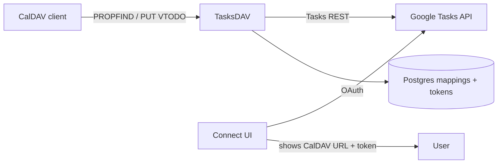

# TasksDAV

## Overview & Core Goal

**TasksDAV** is a multi-user CalDAV façade over **Google Tasks** (the source of truth).

Users connect a Google account once, copy a CalDAV URL (+ credentials), and use any CalDAV task client (Errands, Apple Reminders, DAVx5, Evolution, etc.). Google keeps the real tasks; TasksDAV only stores OAuth tokens, sync mapping state, and per-user CalDAV credentials.

**Not in scope:** Nextcloud, Notion, datetime fiction, a full todo GUI, Microsoft To Do (Future).

## Architecture & Stack

| Layer | Choice |
|-------|--------|
| API / CalDAV | FastAPI (Python 3.12+) via `uv` |
| DB | Neon Postgres (SQLite allowed for local-only smoke) |
| Frontend | React + TypeScript, `pnpm` — single “Connect → Copy URL” page |
| Auth to Google | OAuth 2.0 (`https://www.googleapis.com/auth/tasks`) |
| Auth to CalDAV | Per-user basic auth (app password / random token) |
| Deploy | Vercel (GitHub-linked) + Neon |
| Secrets | Env / Infisical in prod |

**SoT rule:** Google Tasks wins on conflict unless the write originated from CalDAV in the same sync window (last-writer with etag/syncToken discipline).

## API / Data Contracts

### Field mapping (MVP)

| Google Tasks | CalDAV / iCalendar |
|--------------|--------------------|
| `title` | `SUMMARY` |
| `notes` | `DESCRIPTION` |
| `due` (date only) | `DUE;VALUE=DATE` |
| `status` needsAction/completed | `STATUS` NEEDS-ACTION / COMPLETED + `COMPLETED` |
| `parent` (1-level subtask) | child VTODO + `RELATED-TO;RELTYPE=PARENT` |
| task list | one CalDAV calendar / collection |
| `links[]` | read-only; surface in DESCRIPTION footer if present; never invent writes |

**Out of contract:** time-of-day on `due`, deep nesting, writable arbitrary links, recurrence (Future).

### HTTP surfaces

| Path | Purpose |
|------|---------|
| `GET /` | SPA (connect + copy URL) |
| `GET /auth/google` | Start OAuth |
| `GET /auth/google/callback` | Finish OAuth; create user + CalDAV token |
| `GET /api/me` | `{ email, caldav_url, caldav_username, caldav_password }` (session) |
| `POST /api/me/rotate-password` | Rotate CalDAV app password |
| `/caldav/` … | CalDAV (Basic auth) |

### CalDAV MVP verbs

- `PROPFIND` depth 0/1 on principal + calendar home + calendars
- `REPORT` `calendar-query` / `calendar-multiget` for VTODOs
- `PUT` create/update VTODO → Google `insert` / `patch` / `move`
- `DELETE` → Google `delete`
- `GET` single object

### Persistence (logical)

- **User:** id, google_sub, email, caldav_username, caldav_password_hash, refresh_token_enc, created_at
- **ListMap:** user_id, google_list_id, caldav_calendar_id, display_name, ctag
- **TaskMap:** user_id, google_task_id, google_list_id, ical_uid, etag, updated_at

## Feature Checklist

### MVP (Must-Have)

- [ ] Google OAuth connect (Tasks scope)
- [ ] After connect: show CalDAV URL + username + app password (copy buttons)
- [ ] Persist tokens + rotate CalDAV password
- [ ] List Google task lists as CalDAV calendars
- [ ] Roundtrip: title, date, description, complete
- [ ] Roundtrip: one-level parent/subtask
- [ ] Basic auth on `/caldav`
- [ ] SPEC-compliant README + `.env.example`

### V1 (Should-Have)

- [ ] Multi-user hardening (session cookies, rate limits)
- [ ] Conflict / etag syncToken discipline documented + tested
- [ ] Podman quadlet + Compose
- [ ] React polish (errors, reconnect, revoke)
- [ ] Health + metrics endpoints

### Future (Nice-to-Have)

- [ ] Hosted multi-tenant SaaS + Google OAuth verification
- [ ] Microsoft To Do adapter (same CalDAV face)
- [ ] Due-date notify (desktop / ntfy)
- [ ] Read-only surface of Google `links[]` as structured props

## Validation Criteria

| Check | Pass when |
|-------|-----------|
| Connect | Fresh Google account completes OAuth and sees copyable CalDAV credentials |
| Errands | Add CalDAV account with given URL; lists appear; create task with title+date+notes; appears in Google Tasks web within one poll/refresh |
| Complete | Mark complete in Errands → completed in Google; reverse also works |
| Subtask | Create child under parent in client or Google → both sides show one-level hierarchy |
| Date | Due date survives roundtrip; no time component asserted |
| Auth | Wrong CalDAV password → 401; revoked Google → clear reconnect path |
| SoT | Edit title in Google; next CalDAV fetch shows new title |

## Assumptions

1. Users accept **date-only** due dates (Google API limit).
2. Self-hosted / single-deploy multi-user first; public SaaS is Future.
3. Clients are standard CalDAV VTODO consumers (Errands primary dogfood).
4. No Nextcloud dependency.
5. SQLite OK for solo local MVP; Postgres for any shared deploy.
